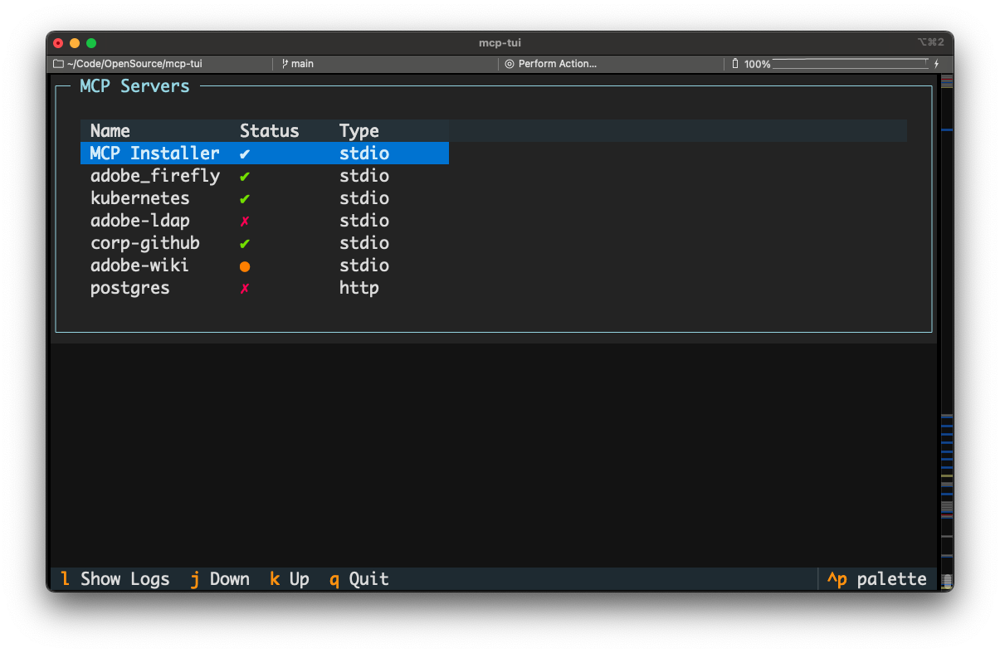
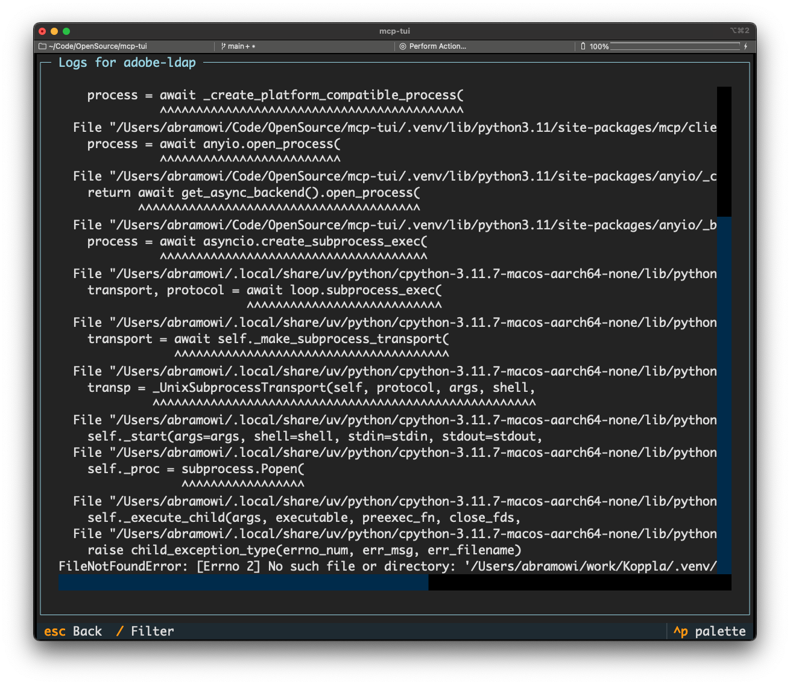
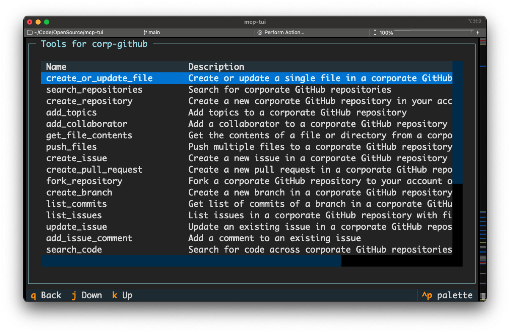
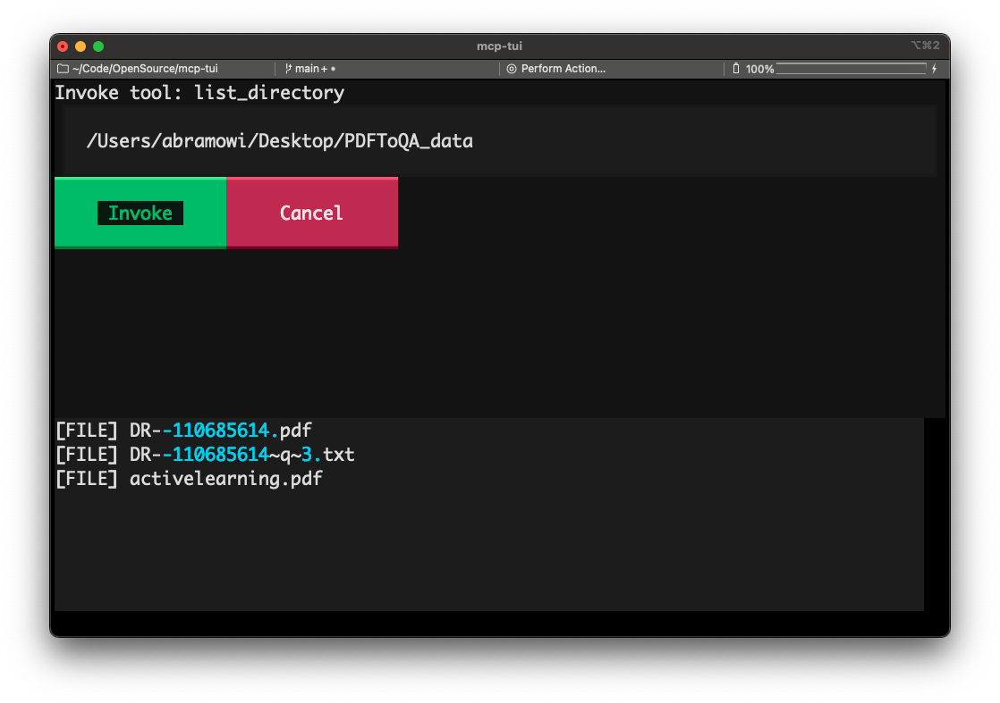

# MCP TUI

## An MCP Host application that runs in your terminal; written in Python

**If you like this project, please consider starring the repo on GitHub! You can also upvote on [Hacker News](https://news.ycombinator.com/item?id=44218230).** ⭐️

**Pull requests are very welcome!** If you have ideas, bug fixes, or improvements, please open a PR.

A Python TUI app using [uv](https://github.com/astral-sh/uv), [Typer](https://typer.tiangolo.com/), and [Textual](https://textual.textualize.io/) to list MCP servers from a `mcp.json` file.

## Screenshots

### MCP server list



### Show logs for an MCP server



### List tools for an MCP server



### Invoke a tool



## Installation (easy) without development

This is if you just want to use the app and not contribute to the development,
which I will not judge you for (even though LLMs make it so easy to vibe-code
and you could just vibe-code some stuff and make a PR but that's okay it's cool.
It is cool).

Install [uv](https://github.com/astral-sh/uv) if you don't have it already.

```sh
uv tool install git+https://github.com/msabramo/mcp-tui
```

## Installation for development

Clone the repository:

```sh
git clone git@github.com:msabramo/mcp-tui.git
cd mcp-tui
```

Install [uv](https://github.com/astral-sh/uv) if you don't have it already.

Install dependencies using [uv](https://github.com/astral-sh/uv):

```sh
uv sync
```

## Usage

Run the app with:

```sh
uv run python mcp_tui/app.py ~/.cursor/mcp.json
```
